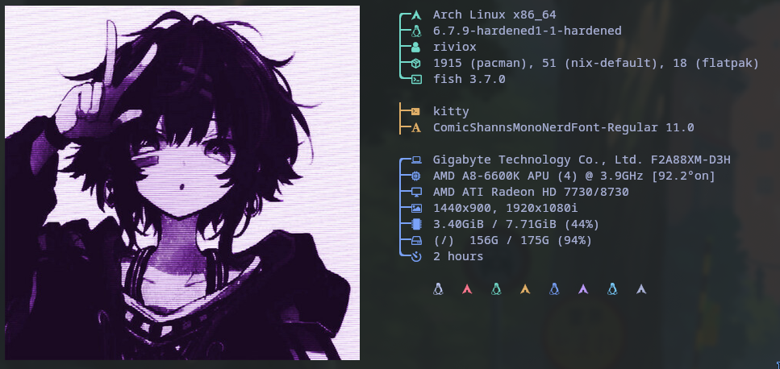
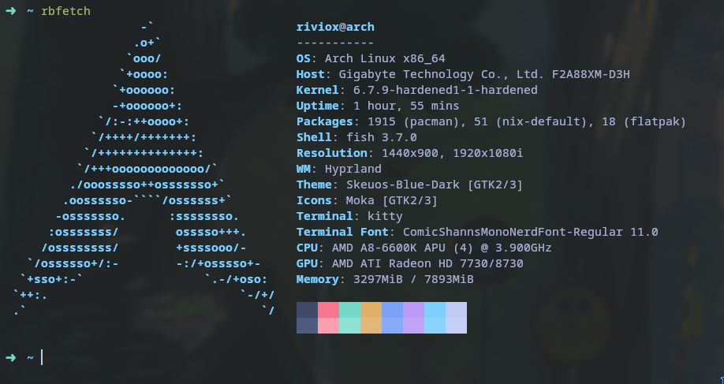

A command-line system information tool written in bash 3.2+

rebornfetch is a command-line system information tool written in `bash 3.2+`. rebornfetch displays information about your operating system, software and hardware in an aesthetic and visually pleasing way.

The overall purpose of rebornfetch is to be used in screen-shots of your system. rebornfetch shows the information other people want to see. There are other tools available for proper system statistic/diagnostics.

The information by default is displayed alongside your operating system's logo. You can further configure rebornfetch to instead use an image, a custom ASCII file, your wallpaper or nothing at all.

You can further configure rebornfetch to display exactly what you want it to. Through the use of command-line flags and the configuration file you can change existing information outputs or add your own custom ones.

rebornfetch supports almost 150 different operating systems. From Linux to Windows, all the way to more obscure operating systems like Minix, AIX and Haiku. If your favourite operating system is unsupported: Open up an issue and support will be added.

### More: \[[Dependencies](https://github.com/riviox/rebornfetch/wiki/Dependencies)\] \[[Installation](https://github.com/riviox/rebornfetch/wiki/Installation)\] \[[Wiki](https://github.com/riviox/rebornfetch/wiki)\]
### Copyright (c) 2015-2021 Dylan Araps
### Copyright (c) 2024-now riviox
